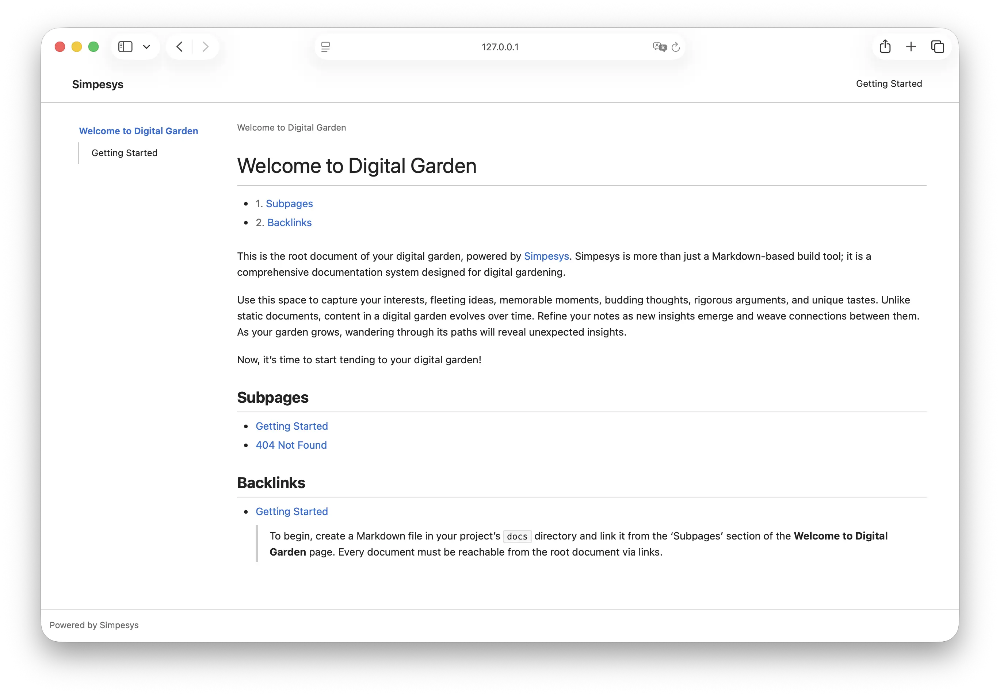

# 🌿 Simpesys

> https://pedia.simpesys.deno.net/

Simpesys is a Markdown file–based documentation build tool that also serves as a complete documentation system for digital gardens. The name "Simpesys" is a portmanteau of "[Simonpedia](https://github.com/parksb/pedia)" and "system", pronounced /sɪmˈpesɪs/.

## Getting Started

You can quickly scaffold a digital garden using Simpesys CLI tool.

```sh
$ deno run -R -W -E jsr:@simpesys/cli init my-garden
$ cd my-garden
$ deno task start
```

After running these commands, you can check out your digital garden in the browser.



For detailed instructions on building a digital garden with Simpesys, see the [Getting Started](https://pedia.simpesys.deno.net/getting-started) document.

## Design Principles

Simpesys models the entire document system as a tree. However, since documents can cross-reference each other, the hierarchical model forms a tree while the reference model can become a connected directed graph with circuits. This structure allows Simpesys to maintain a simple overall document structure while managing complex reference relationships between documents. Upon initialization, Simpesys reads the designated root Markdown document. Starting from the root document, it parses internal link syntax within the content and repeatedly reads connected documents to build the complete document tree. Simpesys constructs this document tree and provides APIs for working with it.

### Document-Centric Design

Simpesys focuses exclusively on documents. Each Markdown file in the document directory represents a single document. Every document is identified by a unique relative path from the root document and can have either a flat or hierarchical structure. Simpesys treats all internal links connected to the root document as documents. The "Page Not Found" document, required to represent missing documents, is not treated exceptionally but exists as a regular subdocument of the root.

### High Connectivity

Simpesys emphasizes connectivity between documents. The core of a digital garden lies in the high connectivity between documents. Shortening the distance from one document to another is a goal that should be continuously pursued while maintaining a digital garden. As documents accumulate, carving out personal paths through the vast forest becomes increasingly important, and users should be able to naturally gain new inspiration while strolling along the paths they have created. A digital garden is not a wiki for preserving objective knowledge. The moment a digital garden becomes a personal wiki, it degrades into a Wikipedia without collective intelligence.

### Application Layer Separation

Simpesys itself is not a tool for creating static sites or web applications. The goal of Simpesys is to structure a document system and provide APIs for working with that structure. While Simpesys converts Markdown to HTML during initialization, this is less about building an application and more about providing an intermediate layer for representing documents in a standardized way. Application implementation is the user's responsibility, and Simpesys has no dependencies for application implementation.

### Narrow and Deep Modules

The module interfaces Simpesys provides to users should be narrow, and the depth of functionality should be deep. Simpesys exposes only essential APIs, and users who want to customize internal behavior can only do so through predefined option values. Simpesys follows "convention over configuration" by providing sensible defaults for all configuration options.

## License

Simpesys is distributed under the [GNU General Public License v3.0](LICENSE).
