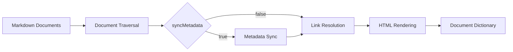

# Architecture

This document describes the internal architecture of Simpesys, including core data structures and the build pipeline.

Simpesys processes Markdown documents through a multi-stage pipeline. The system maintains a document dictionary that maps document keys to processed document objects. During initialization, documents are traversed through breadth-first search starting from the root document.

## Core Components

### Simpesys

The `Simpesys` class is the main entry point. It manages document loading and processing, and provides access to the processed document dictionary.

```typescript
class Simpesys {
  constructor({ config, hooks }: DeepPartial<Context>);
  init(options?: { syncMetadata?: boolean }): Promise<Simpesys>;
  getDocuments(): DocumentDict;
  getDocument(key: string): Document | undefined;
  getConfig(): Config;
}
```

The constructor accepts a partial configuration. Unspecified options use default values. The `init()` method must be called before accessing documents.

### Context

The `Context` type combines configuration and hooks into a single object passed to internal functions.

```typescript
type Context = {
  config: Config;
  hooks: Hooks;
};
```

For details on available options, see the [[configuration]] document.

### Document

The `Document` interface represents information about a built document.

| Property | Type | Description |
|----------|------|-------------|
| `title` | `string` | Document title extracted from the first level 1 heading |
| `filename` | `string` | Document key (filename without extension) |
| `markdown` | `string` | Markdown document content |
| `html` | `string` | HTML converted from Markdown |
| `breadcrumbs` | `Breadcrumb[]` | Path from root |
| `children` | `Document[]` | Subdocuments |
| `parent` | `Document` | Parent document |
| `referred` | `Reference[]` | Documents that reference this document |
| `type` | `"subject"` \| `"publication"` | Document classification |
| `createdAt` | `Temporal.Instant` | Creation timestamp |
| `updatedAt` | `Temporal.Instant` | Last modification timestamp |

### DocumentDict

The `DocumentDict` type is a record that maps document keys to `Document` objects:

```typescript
type DocumentDict = Record<string, Document>;
```

A document key is a unique identifier derived from the relative path from the root document without the `.md` extension. For example, the key for `features/internal-links.md` is `features/internal-links`.

### Reference

The `Reference` interface represents a backlink relationship.

```typescript
interface Reference {
  document: Document; // Document containing the link
  sentences: string[]; // Sentences mentioning the link
}
```

## Build Pipeline

Initialization proceeds through the following stages:



### Document Traversal

Starting from the root document, all documents are traversed using breadth-first search, with each document processed as follows:

1. Read the Markdown file from the filesystem.
2. If a `manipulateMarkdown` hook is defined, execute it to modify the Markdown.
3. Extract the document title from the first level 1 heading.
4. Load or create metadata timestamps.
5. Add the document to the dictionary.
6. Add subdocuments listed in the subdocuments section to the processing queue.

### Link Resolution

After all documents are traversed, internal links are processed:

1. Resolve and label internal links in each document.
2. Match links against the document dictionary.
3. If there are unresolved links and an `onInternalLinkUnresolved` hook is defined, execute it to handle the error.
4. For each valid link, add a backlink reference to the target document.

### HTML Conversion

Finally, each document is converted to HTML:

1. Add backlinks section.
2. Insert table of contents before the title.
3. Convert Markdown to HTML.
4. Replace internal link syntax with HTML anchor tags using the `renderInternalLink` hook.

## Document Types

Documents are classified into two types:

| Type | Description |
|------|-------------|
| `subject` | Subject document |
| `publication` | Publication document |

The type affects how documents are displayed in the subdocuments section and can be customized in custom rendering logic. By default, documents mentioned under a level 3 `Publications` heading are classified as publication documents. The publication section title can be configured using the `config.docs.publicationsSectionTitle` option.
